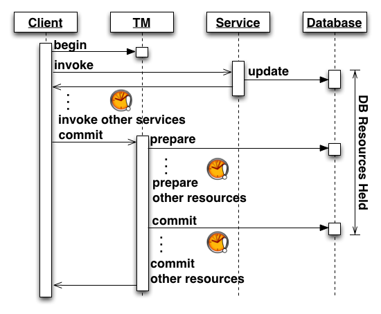
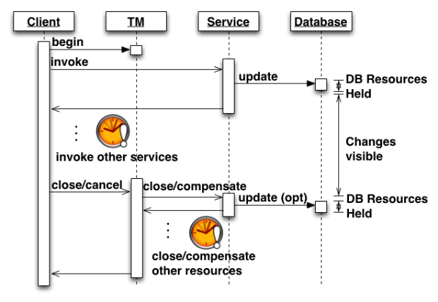

ACID transactions are a useful tool for application developers and can provide very strong guarantees, even in the presence of failures.
However, ACID transactions are not always appropriate for every situation.
In this series of blog posts.
I'll present several such scenarios and show how an alternative non-ACID transaction model can be used.

The isolation property of an ACID transaction is typically achieved through [optimistic or pessimistic concurrency control](http://en.wikipedia.org/wiki/Lock_(computer_science)).
Both approaches can impose negative impacts on certain classes of applications, if the duration of the transaction exceeds a few seconds (see [here](http://www.theserverside.com/news/1365143/ACID-is-Good-Take-it-in-Short-Doses) for a good explanation).
This can frequently be the case for transactions involving slow participants (humans, for example) or those distributed over high latency networks (such as the Internet).
Also, some actions cannot simply be rolled back; such as, the sending of an email or the invocation of some third-party service.

A common strategy for applications that cannot use ACID, is to throw out transactions altogether.
However, with this approach you are missing out on many of the benefits that transactions can provide.
There are many alternative transaction models that relax some of the ACID properties, while still retaining many of the strong guarantees essential for building robust enterprise applications.
These models are often referred to as "Extended Transaction models" and should be considered before deciding not to use transactions at all.

In the Narayana project, we have support for three Extended Transaction models; "Nested Top Level Transactions" [REF], "Nested Transactions" [REF] and a compensation-based model based on "Sagas" [REF].
In this series of blog posts I'll be focusing on the compensation-based approach.

# What is a ‘Compensation-based transaction’?

Transaction systems typically use a two-phase protocol to achieve atomicity between participants.
This is the case for both ACID transactions and our compensation-based transactions model.
In the first phase, each individual participant, of an ACID transaction, will make durable any state changes that were made during the scope of the transaction.
These state changes can either be rolled back or committed later once the outcome of the transaction has been determined.
However, participants in a compensation-based transaction behave slightly differently.
Here any state changes, made in the scope of the transaction, are committed during (or prior) to the first phase.
In order to make "rollback" possible, a compensation handler is logged during the first phase.
This allows the state changes to be 'undone' if the transaction later fails.

# What Affect Does this Have on the Isolation property of the Transaction?

The Isolation property of a transaction dictates what, if any, changes are visible outside of the transaction, prior to its completion.
For ACID transactions, the isolation property is usually pretty strong with database vendors offering some degree of relaxation via the isolation level configuration [REF].
However, in a compensation-based transaction the isolation level is totally relaxed allowing units of work to be completed and visible to other transactions, as the current compensation-based transaction progresses.
The benefit of this model is that database resources are not held for prolonged periods of time.
However, the down-side is that this model is only applicable for applications that can tolerate this reduced level of isolation.

The following two diagrams show an example, where a client is coordinating invocations to multiple services that each make updates to a database.
The diagrams are simplified in order to focus on the different isolation levels offered by an ACID and compensation-based transaction.
The example also assumes a database is used by the service, but it could equally apply to other resources.

The diagram above shows a simplified sequence diagram of the interactions that occur in an ACID transaction.
After the client begins the (ACID) transaction it invokes the first service. 
This service makes a change to a database; and at this point database resources are held by the transaction.
This example uses pessimistic locking.
Had optimistic locking been used, the holding of database resources could have been delayed until the prepare phase, but this could result in more failures to prepare.
The Client then invokes the other services, who may in turn hold resources on other transactional resources.
Depending on the latency of the network and the nature of the work carried out by the services, this could take some time to complete.
All the while, the DB resources are still held by the transaction.
If all goes well, the client then requests that the transaction manager commit the transaction.
The transaction manager invokes the two-phase commit protocol; by first preparing all the participants and then if all goes well, commits all the participants.
It's not until the database participant is told to commit, that these database resources are released.

From the diagram, you can see how, in an ACID transaction, DB resources could be held for a relatively long period of time.
Also, assuming the service does not wish to make a heuristic decision, this duration is beyond the control of the service.
It must wait to be informed of the outcome of the protocol, which is subject to any delays introduced by the other participants.

The diagram above shows a simplified sequence diagram of the interactions that occur in a compensation-based transaction.
The client begins a new (compensation-based) transaction and then invokes the first service.
The service then sends an update to the database, which is committed immediately, in a relatively short, separate ACID transaction.
At this point (not shown in the diagram) the service informs the transaction manager that it has completed it's work, which causes the transaction manager to record the outcome of this participant's work to durable storage along with the details of the compensation handler and any state required to carry out the compensation.
It's possible to delay the commit of the ACID transaction until after the compensation handler has been logged (see here [REF]), this removes a failure window in which a non-atomic outcome could occur.

The client now invokes the other services who, in this example, behave similarly to the first service.
Finally, the client can request that the Transaction Manager close (commit) or cancel (rollback) the compensation-based transaction.
In the case of cancel, the transaction manager calls the compensating action associated with each participant that previously completed some work.
In this example, the compensating action makes an update to the database in a new, relatively short ACID transaction.
The service can also be notified if/when the compensation-based transaction closes.
I'll cover situations when this is useful later in this series.
The notification of (close/compensate) is retried until it is acknowledged by the service.
Although this is good for reliability, it does require that the logic of the handlers be idempotent.

From the diagram, you can see that the duration for which DB resources are held, is greatly reduced.
This comes at a cost of relaxed isolation (see the 'changes visible' marker on the diagram).
However, in scenarios where compensation is rare, the relaxed isolation could be of little concern as the visible changes are usually valid.

It is also possible to mitigate this loss of isolation by marking the change as tentative in the first phase and then marking the change as confirmed/cancelled in the second phase.
For example, the initial change could mark a seat on a plane as reserved; the seat could later be released or marked as booked, depending on the outcome of the transaction.
Here we have traded the holding of database-level resources for the holding of application-level resources (in this case the seat).
This approach is covered in more detail later in the series.

# What's Coming up in the Next Posts?
The following three posts will each focus on particular set of use-cases where compensation-based transactions could prove to be a better fit than ACID transactions.
In each part, I'll provide a code example, using the latest iteration of our new API for compensation-based transactions (first introduced in [REF]).

* **Part 2: Non-transactional Work**
This part will cover situations where you need to coordinate multiple non-transactional resources, such as sending an email or invoking a third party service.

* **Part 3: Cross-domain Distributed Transactions**
This part covers a scenario where the transaction is distributed, and potentially crosses multiple business domains.

* **Part 4: Long-lived Transactions**
This part covers transactions that span long periods of time and shows how it's possible to continue the transaction even if some work fails.